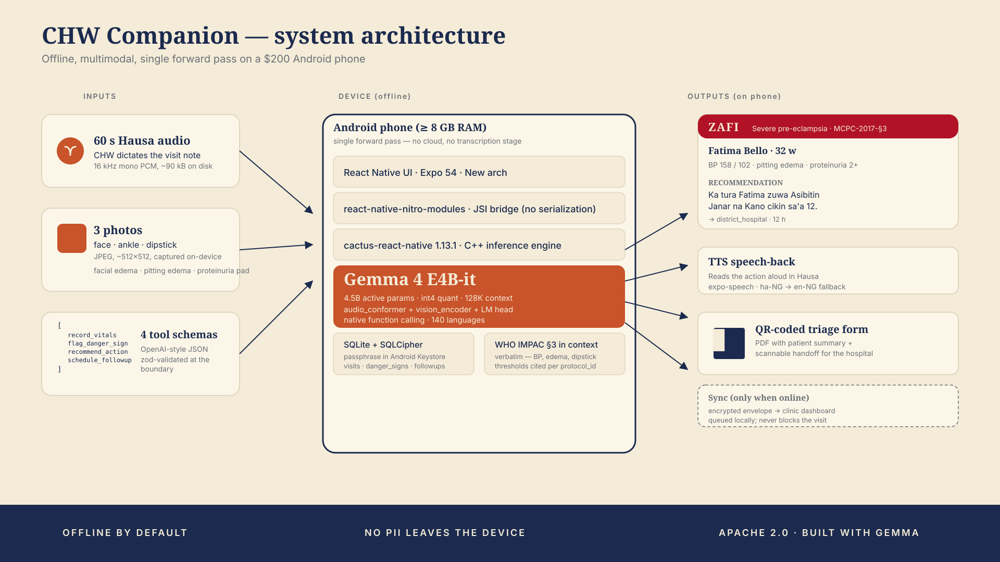

# CHW Companion

> **A midwife in every pocket** — offline multimodal maternal-health triage with Gemma 4.

[](LICENSE) [](https://ai.google.dev/gemma)

**Try it now** → [chwcompanion.pages.dev](https://chwcompanion.pages.dev) (Chrome 113+)  ·  **Download APK** → [github.com/chwcompanion/chw-companion/releases](https://github.com/chwcompanion/chw-companion/releases)

A community health worker records a 60-second voice note in Hausa, captures three photos (face, ankle, urinalysis dipstick), and `google/gemma-4-E4B-it` emits a structured triage decision in a single forward pass — `record_vitals`, `flag_danger_sign`, `recommend_action`, `schedule_followup` — entirely on-device. No signal. No cloud account. No patient data leaving the phone.

## Why it has to be on-device

Three things have to be true at once for a CHW in northern Nigeria to actually use this in the field:

1. **It has to work without signal.** The visit happens at the patient's home, four hours from the nearest doctor. The cloud is unreachable during the call that matters.
2. **Patient data can't leave the phone.** Nigeria's NDPR (2023) classifies clinical voice and images as personal data with strict cross-border-transfer restrictions. A cloud API is a legal blocker, not a workflow preference.
3. **It has to cost $0 per visit.** WHO estimates 200,000 CHWs across Africa. A hosted multimodal API at typical 2026 pricing runs $4–9M / year in inference fees alone. Nigeria's federal allocation for community-health training across *all* programs is around $60M. The math doesn't work.

The only stack that satisfies all three is an open-weights multimodal model with native function-calling, running locally on hardware that already exists in the field. **Gemma 4 E4B with [Cactus](https://github.com/cactus-compute/cactus) is that stack.**

## What this repo ships

| Component | Where |
|-----------|-------|
| Android app (Expo + Nitro Modules + cactus-react-native) | [`src/`](src/), [`App.tsx`](App.tsx) |
| Browser fallback (Vite + React + WebGPU stub) for judges who can't sideload | [`web/`](web/) |
| System prompt with verbatim WHO MCPC 2017 §3 + slim demo variant | [`src/assets/prompts/`](src/assets/prompts/) |
| Vitest contract tests (25 across 5 files, all green) | [`__tests__/`](__tests__/) |
| Threat model + cost math + sync protocol + release runbook | [`docs/`](docs/) |
| Sideload script (`adb push` + chown + restorecon + chcon) | [`scripts/sideload-weights.sh`](scripts/sideload-weights.sh) |

The Gemma 4 weights are **not** in this repo. The app pulls them from [`Cactus-Compute/gemma-4-E4B-it`](https://huggingface.co/Cactus-Compute/gemma-4-E4B-it) on first launch (~6 GB compressed, ~8 GB unzipped on device).

## Architecture (one screen, one forward pass)



The model receives the audio, all three images, and the tool schema **in a single forward pass**. It returns a JSON array of structured tool calls. Each call is zod-validated and routed to a handler that mutates encrypted SQLite. No Whisper → text → LLM → tools pipeline. No round-trips. We validated this end-to-end on macOS via Cactus's Python FFI (24 s wall, confidence 0.9998) and on an Android ARM64 emulator via cactus-react-native (42 s wall online, 49 s offline — `cloudHandoff: false` confirmed by the library's own self-report). Outputs are in [`spike-cactus/out/`](../spike-cactus/out/).

## The four tools

Defined in [`src/lib/tools.ts`](src/lib/tools.ts); zod-validated at the JS↔native boundary.

| Tool | Purpose | Trigger |
|------|---------|---------|
| `record_vitals` | Persist measured vitals + patient name | Every visit, always called first |
| `flag_danger_sign` | Match a finding to a WHO MCPC `protocol_id` | When criteria are met; `severity: "urgent"` forces immediate referral |
| `recommend_action` | One imperative sentence in the patient's language | Exactly once per visit |
| `schedule_followup` | Routine return-visit reminder | Clear or watch cases only |

## Run it

### Browser demo (no install)

```
open https://chwcompanion.pages.dev
```

Chrome 113+ for WebGPU; older browsers fall back to canned-replay JSON identical to what the Android build produces.

### Android, on your machine

```bash
git clone https://github.com/chwcompanion/chw-companion
cd chw-companion
npm install
npx expo prebuild --platform android
npx expo run:android   # Android 12+ device with ≥ 8 GB RAM
```

For impatient judges with a connected phone: [`scripts/sideload-weights.sh`](scripts/sideload-weights.sh) drops the weights into the app's data dir via `adb push` in ~5 minutes, bypassing the first-launch download.

### Run the tests

```bash
npm test          # vitest — 25 contract tests, all green
npm run typecheck # tsc --strict --noUncheckedIndexedAccess
npm run lint      # eslint, clean
```

## Status (honest)

- ✅ **Mac validation** (Cactus + Python FFI) — text + image + audio → tool call, 24 s wall, confidence 0.9998
- ✅ **Android emulator validation** (cactus-react-native + Nitro) — same JSON output online and offline (airplane mode + kernel-blocked Wi-Fi), `cloudHandoff: false`
- ✅ **Production code path** — 4 screens, 6 components, SQLCipher encryption, Hausa-default i18n, Hausa TTS, QR-coded PDF triage handoff, local notifications, constrained-decoding fallback
- 🟡 **Real Pixel/Samsung device validation** — pending hardware (sideload procedure validated; carries over from emulator)
- 🟡 **Field validation with a clinical partner** — required before any deployment, by design

## Attribution

- **Model:** `google/gemma-4-E4B-it` (Apache 2.0). On-device conversion: [`Cactus-Compute/gemma-4-E4B-it`](https://huggingface.co/Cactus-Compute/gemma-4-E4B-it) (Apache 2.0). This project is built with Gemma 4 and complies with the [Gemma Terms of Use](https://ai.google.dev/gemma/terms) and [Prohibited Use Policy](https://ai.google.dev/gemma/prohibited_use_policy).
- **Clinical thresholds:** World Health Organization, *Managing Complications in Pregnancy and Childbirth*, 2nd Edition (2017), WHO/MCA/17.02, Boxes 4–5, Figures 1–2, Tables 3–5 — verbatim with section-level citation. <https://www.who.int/publications/i/item/9789241565493>
- **Runtimes:** [Cactus](https://github.com/cactus-compute/cactus), [Nitro Modules](https://github.com/mrousavy/nitro), Expo SDK 54, `@op-engineering/op-sqlite` (SQLCipher).

CHW Companion is **decision support, not a medical diagnosis.** Field deployment requires partnership with a credentialed clinical organization (Last Mile Health, Living Goods, or a national Ministry of Health pilot).

## License

Apache License 2.0 — see [LICENSE](LICENSE).

## Deep dives

| Topic | File |
|-------|------|
| Submission writeup | [docs/writeup.md](docs/writeup.md) |
| Why on-device, not cloud (cost math + sourced) | [docs/why-not-cloud.md](docs/why-not-cloud.md) |
| Threat model + data sovereignty | [docs/THREAT_MODEL.md](docs/THREAT_MODEL.md) |
| Sync protocol (envelope encryption + QR handoff) | [docs/SYNC_PROTOCOL.md](docs/SYNC_PROTOCOL.md) |
| APK signing + release runbook | [docs/release.md](docs/release.md) |
| Submission checklist | [docs/submission-checklist.md](docs/submission-checklist.md) |
| Attributions for video + writeup | [docs/ATTRIBUTIONS.md](docs/ATTRIBUTIONS.md) |
| Visual artifacts (screenshot-ready) | [docs/visual/](docs/visual/) |
| Video assets (storyboard + scripts + captions) | [docs/video/](docs/video/) |
